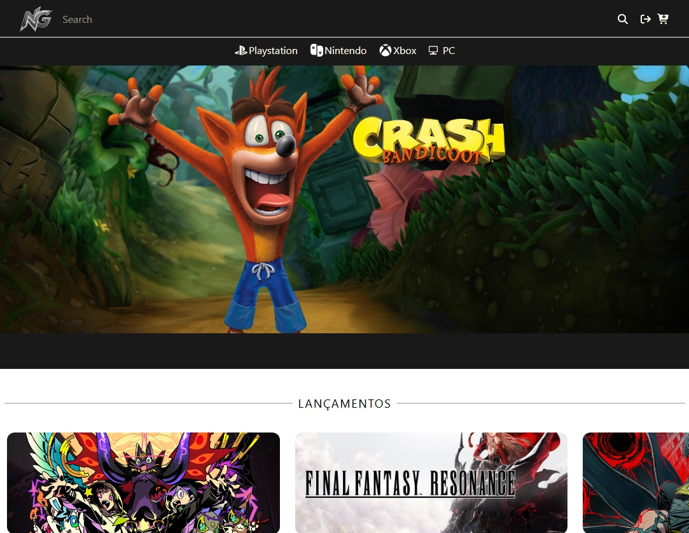
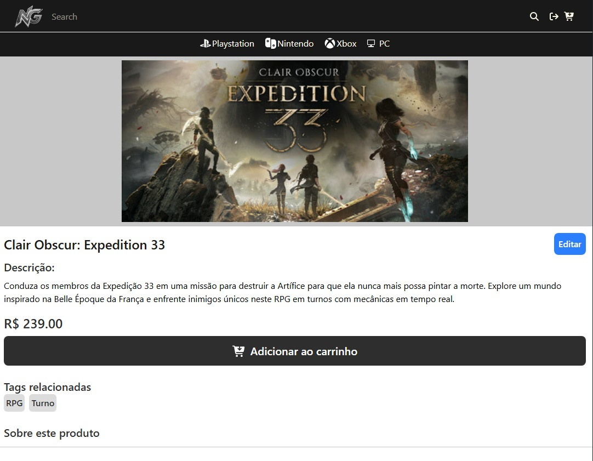

<h1 align="center" style="font-weight: bold;">Neo Gaming 🎮</h1>

<p align="center">
  <a href="#technologies">Technologies</a> • 
  <a href="#architecture">API & Architecture</a> • 
  <a href="#started">Getting Started</a> 
</p>

<p align="center">
    <b>Front End of Neo Gaming store.</b>
</p>

<p align="center">
     <a href="https://neo-gaming-wine.vercel.app/">📱 Visit "Neo Gaming"</a>
</p>

<h2 id="layout">🎨 Layout</h2>

<p align="center">
    
    
</p>


<h2 id="technologies">💻 Technologies</h2>


<h2 id="architecture">⚡ API Integration & Core Architecture</h2>

- 🎮 **Game Catalog Data:** Consumes Django REST Framework endpoints to fetch game listings, detailed views, categories, and pricing information.
- 🔐 **User Authentication:** Communicates directly with Django's authentication system (token/session based) for secure user registration, login, logout, and protected route access.
- 🛠️ **Admin CRUD:** Provides functions to admin create, edit and delete games without acessing the API directly.
- 🌐 **Responsive Design:** Fully responsive layout tailored for desktops, tablets, and mobile devices.

<h2 id="started">🚀 Getting Started</h2>

Follow the steps below to run the project locally.

### Prerequisites

Make sure you have installed:

- [Node.js](https://nodejs.org/)
- [Git](https://git-scm.com/)

### Environment Setup

Create a `.env` file in the root directory and specify the URL of your Django backend API:

```
VITE_MERCADO_PAGO_PUBLIC_KEY=APP_USR-EXAMPLE
VITE_BACKEND_URL=http://backend.url/
VITE_HIGHLIGHT_GAME_ID=1
VITE_ADMIN_LOGIN=admin
VITE_ADMIN_PASSWORD=admin
```

### Cloning

```bash
git clone https://github.com/michaelcostaribeiro/game_store-frontend
```

<h3>Starting</h3>

```bash
npm install
npm run dev
```

<h2>📄 License</h2>

This project is under the MIT License.
